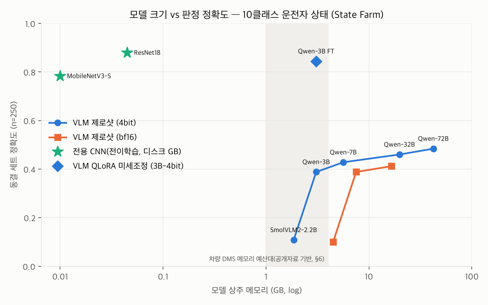

# vlm-incabin-feasibility

**공개 데이터셋 기반 개인 기술 검토(personal feasibility study on public data).**
차량 실내 탑승자(운전자) 상태 판정에 소형 VLM(Vision-Language Model)이 쓸 만한지,
차량용 엣지에 올리려면 무엇이 부족한지를 측정으로 검증한다.

> Personal side-project. Uses **only public datasets and public documents** —
> no proprietary data, labels, code, or specs from any employer. All inference
> is local (Apple M4 Max 128GB, MLX). Negative results are reported as-is.

최종 결과 보고서: [`VLM_FEASIBILITY_PACK.md`](VLM_FEASIBILITY_PACK.md)

**한 줄 결론 — 소형 VLM은 이 과제에서 전용 CNN을 이기지 못한다: 제로샷 최고
42.8% vs CNN 88.0%, QLoRA 미세조정으로 84.4%(CNN급)에 도달해도 70배 작은
ResNet18이 존재하고 개방 어휘 능력은 파괴된다 → 차량 엣지 1차 판정기 (c) 불가,
개방 어휘 보조역 (b) 미확립.**

## 결과 요약 (1차 2026-07-26, §11 후속 실측 2026-07-27)

> 제로샷/few-shot 소형 VLM(2~7B)은 이 과제에서 전용 소형 CNN의 상대가 되지
> 않는다. **상시 1차 판정기로서의 차량 엣지 적용은 (c) 현재 불가.**
> 후속 실측(§11) 결과, 당초 "(b) 조건부 가능"으로 추정했던 미세조정·하이브리드
> 보조 역할도 **(b) 미확립**로 격하 — 미세조정은 분류를 CNN급으로 올리지만
> 개방 어휘 서술 능력을 파괴해, 분류와 서술을 동시에 만족하는 지점이 측정
> 범위에 없었다.

| 모델 (동결 250장, 제로샷 p1) | 정확도 | p50 지연* | 피크 메모리 |
|---|---|---|---|
| SmolVLM2-2.2B 4bit | 10.8% (우연=10%) | 0.98s | 2.9GB |
| Qwen2.5-VL-3B 4bit | 38.8% | 0.58s | 4.0GB |
| Qwen2.5-VL-7B 4bit | 42.8% | 1.23s | 6.4GB |
| Qwen2.5-VL-32B 4bit (상한 참조) | 46.0% | 5.34s | 20.7GB |
| Qwen2.5-VL-72B 4bit (상한 참조) | 48.4% | 10.91s | 43.2GB |
| **Qwen2.5-VL-3B 4bit + QLoRA 미세조정(§11)** | **84.4%** | 0.78s | 4.4GB |
| **MobileNetV3-S 전이학습 (4.9분)** | **78.4%** | 0.007s | 6.2MB 모델 |
| **ResNet18 전이학습 (6.8분)** | **88.0%** | 0.005s | 44.8MB 모델 |

*Apple M4 Max 측정 — 상대 비교 전용, 차량 SoC 성능 아님.

핵심 발견: VLM 공통의 좌우 규약 혼동(~20%p, 72B는 역방향), 프롬프트 민감도
최대 16.8%p, 생성 붕괴(→ mlx-vlm 청크 프리필 버그로 규명, §11), 4bit 양자화
정확도 비용 ≈0, 다중 프레임 4장 포화(+3%p), 합성 심박 컨텍스트는 사실상 무시됨.

**후속 실측(§11, 2026-07-27)**: QLoRA 미세조정으로 3B-4bit이 **84.4%**
(제로샷 38.8%, CNN과 통계적으로 구분 불가)에 도달, 좌우 혼동·프롬프트 민감도
완전 해소. 그러나 **개방 어휘 서술 능력 파괴**(JSON 유출 50~100%) —
분류와 서술을 동시에 만족하는 지점은 측정 범위에 없었고, 같은 정확도의
ResNet18이 70분의 1 크기로 존재. 판정: 폐쇄 분류기 (c) 유지, 개방 어휘 보조역
(b)는 혼합 학습 입증 전까지 미확립. 붕괴 이슈 재현·제출문: `docs/oss/`.



## 무엇을 측정하나

| 단계 | 내용 |
|---|---|
| 1 | 공개 데이터(10-클래스 운전자 상태) + sha256 동결 평가 세트 250장 |
| 2 | 모델 크기별 정확도 곡선: SmolVLM2-2.2B / Qwen2.5-VL 3B / 7B (+ 32B/72B 4bit 상한 참조점), 제로샷/few-shot, JSON 파싱 실패율, 프롬프트 민감도 |
| 3 | 동일 데이터로 전이학습한 전용 소형 CNN 베이스라인과 비교 |
| 4 | 크기 × 양자화(fp16/4bit) → 정확도·지연 p50/p95·피크 메모리·디스크 |
| 5 | 시간축 한계: 단일 vs 다중 프레임(2~8장) 판정·비용 |
| 6 | 공개 자료 기반 차량 SoC 제약 대비 적용 타당성 판정 |
| 7 | 영상 + 합성 생체 컨텍스트 융합 구조 확인 (**심박 값은 합성이며 실측 아님**) |
| §11 | 후속 실측: QLoRA 미세조정(전 클래스 + c9 홀드아웃), 개방 어휘 유지 시험, 생성 붕괴 원인 규명(upstream 이슈 준비) |

## 데이터와 라이선스

- 데이터: **State Farm Distracted Driver Detection** (Kaggle 대회, 10-클래스
  운전자 상태, 640×480 실내 카메라). 원본은 Kaggle 대회 페이지에서 제공되며
  대회 규정(rules)의 사용 조건을 따른다. 본 저장소는 **이미지를 재배포하지
  않는다** — 코드·집계 결과·파일명+해시 매니페스트만 공개하고, 데이터는
  `scripts/download_data.sh`로 각자 내려받는다.
- Kaggle API 인증(`~/.kaggle/kaggle.json`)이 있으면 공식 경로로 받을 수 있고,
  없으면 스크립트가 HuggingFace 미러(`gymprathap/Driver-Distracted-Dataset`,
  데이터 카드에 포괄적 `cc` 태그만 표기·구체 변형 미명시)를 사용한다. 미러의
  라이선스 표기가 원 대회 규정을 대체하지 않으므로, 원 데이터의 권리는
  State Farm/Kaggle 대회 규정 기준으로 취급하고 연구·학습 외 사용은 각자
  확인할 것.

## 재현 (3단계)

```bash
# ① 환경 + 데이터 (~4.3GB; Apple Silicon, Python 3.12)
uv venv --python 3.12 .venv && source .venv/bin/activate
uv pip install "mlx-vlm==0.6.7" "torch==2.13.0" "torchvision==0.28.0" matplotlib "huggingface_hub[cli]"
bash scripts/download_data.sh
python scripts/freeze_eval_set.py --data-root data/raw_hf/extracted --out data/frozen_eval

# ② 측정 (GPU 작업은 순차 실행 — 동시 실행 시 지연 측정 왜곡)
bash scripts/run_batch1.sh && bash scripts/run_batch2.sh   # VLM 제로샷/few-shot/양자화
bash scripts/run_batch3.sh && bash scripts/run_batch4.sh   # 상한 참조점 + 다중프레임/융합
PYTHONPATH=scripts python scripts/train_cnn.py --arch mobilenet_v3_small
PYTHONPATH=scripts python scripts/train_cnn.py --arch resnet18
python scripts/build_ft_dataset.py && bash scripts/run_batch5_ft.sh && bash scripts/run_batch5b_desc.sh  # §11 미세조정

# ③ 집계·그림
PYTHONPATH=scripts python scripts/analyze_runs.py          # results/summary.md
PYTHONPATH=scripts python scripts/analyze_fusion.py
PYTHONPATH=scripts python scripts/analyze_openvocab.py
PYTHONPATH=scripts python scripts/make_figures.py          # results/figs/
```

모든 실행 원시 로그는 `runs/`에, 측정 조건은 각 run의 `config.json`에 남는다.
전체 명령 상세는 [`VLM_FEASIBILITY_PACK.md` §9](VLM_FEASIBILITY_PACK.md).

## 측정 환경 주의

모든 지연(latency)은 **Apple M4 Max(128GB)** 에서 측정한 값이다. 차량용 SoC
성능이 아니며, 크기 간 **상대 비교**와 메모리 소요 판단에만 사용한다.
