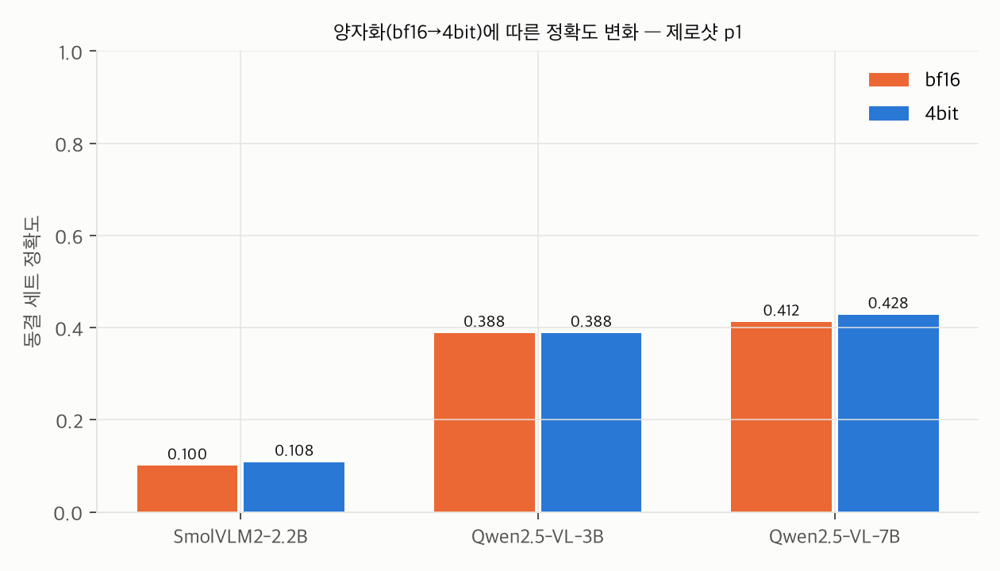
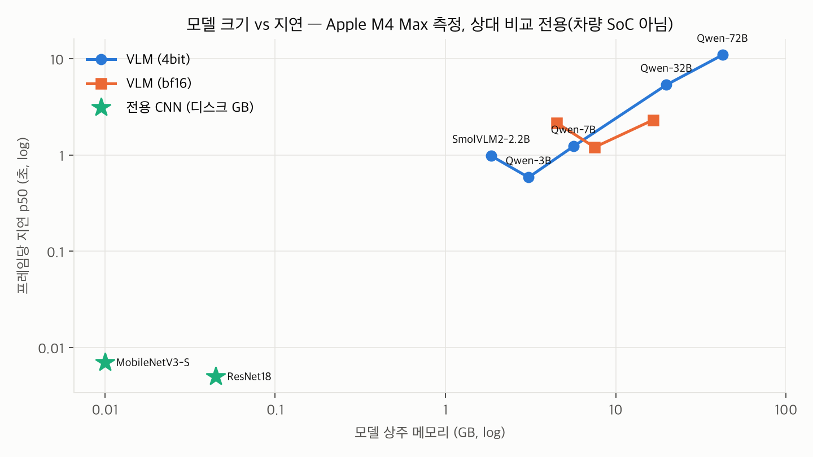
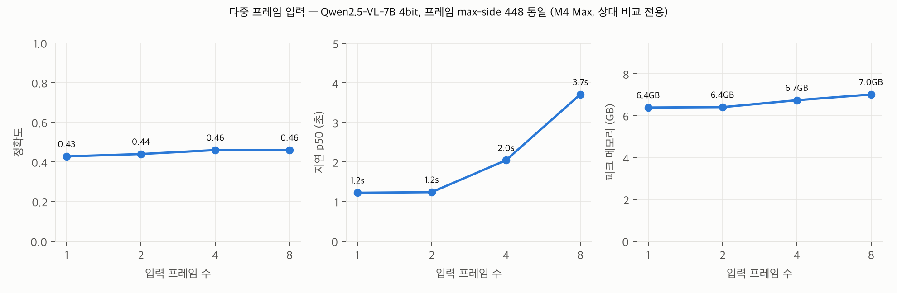

# VLM 실내 운전자 상태 판정 타당성 검토 (VLM_FEASIBILITY_PACK)

**공개 데이터셋 기반 개인 기술 검토.** 회사 데이터·내부 스펙 미사용, 전 과정 로컬 추론.
측정일 2026-07-25~26, Apple M4 Max 128GB(macOS, MLX). 작성 원칙: 측정값이 정본이며
부정적 결과도 그대로 결론으로 낸다.

> **한 줄 결론**: 제로샷/few-shot 소형 VLM(2~7B)은 이 과제에서 **전용 소형 CNN의
> 상대가 되지 않는다** (최선 엣지 후보 7B-4bit 42.8% vs 1.5M 파라미터 MobileNetV3-S
> 78.4%, ResNet18 88.0%). 72B 상한조차 48.4%로 CNN에 30%p 이상 뒤지고, 지연은
> 동일 하드웨어에서 CNN 대비 **약 175~2,200배**. 상시 1차 판정기로서의 차량 엣지
> 적용은 **(c) 현재 불가**.
>
> **[갱신 2026-07-27, §11]** QLoRA 미세조정 실측: 3B-4bit이 84.4%로 CNN급
> (McNemar로 구분 불가)에 도달하고 좌우 혼동·프롬프트 민감도는 완전 해소되지만,
> **개방 어휘 능력이 파괴**되고(서술 요청에 JSON 유출 50~100%) 같은 정확도의
> ResNet18이 70분의 1 크기로 존재한다. 지난 보고의 "(b) 조건부 가능" 추정은
> 실측 후 **(b) 미확립**로 격하 — 분류와 서술을 동시에 만족하는 지점이 측정
> 범위에 없었다.

---

## 목차
1. [과제 정의와 데이터](#1-과제-정의와-데이터)
2. [크기별 VLM 판정 성능](#2-크기별-vlm-판정-성능)
3. [전용 CNN 베이스라인 비교](#3-전용-cnn-베이스라인-비교)
4. [크기 × 양자화 비용표](#4-크기--양자화-비용표)
5. [시간축 한계 실험](#5-시간축-한계-실험)
6. [차량 엣지 적용 판정](#6-차량-엣지-적용-판정)
7. [영상+생체 융합 실험 (합성)](#7-영상생체-융합-실험-합성)
8. [이력서 문구 가이드](#8-이력서-문구-가이드)
9. [재현 방법과 공개 파일 목록](#9-재현-방법과-공개-파일-목록)
10. [한계와 후속 과제](#10-한계와-후속-과제)
11. [후속 실측 (2026-07-27): QLoRA 미세조정과 붕괴 원인 규명](#11-후속-실측-2026-07-27-qlora-미세조정과-붕괴-원인-규명)

---

## 1. 과제 정의와 데이터

**과제**: 실내 카메라 1장(또는 프레임 시퀀스)으로 운전자 상태를 10클래스로 분류.
클래스: c0 안전운전, c1/c3 문자(우/좌), c2/c4 통화(우/좌), c5 라디오 조작,
c6 음료, c7 뒤로 손 뻗기, c8 화장/머리손질, c9 동승자와 대화.

**데이터**: State Farm Distracted Driver Detection (Kaggle 대회 데이터, 640×480
실내 카메라, 학습셋 22,424장/운전자 26명).
- 취득 경로: Kaggle API 인증이 로컬에 없어(공식 경로 차단) HuggingFace 미러
  `gymprathap/Driver-Distracted-Dataset`(4.3GB, 원본과 동일 구조
  `imgs/train/c0..c9` + `driver_imgs_list.csv`)로 대체했다. **공식 경로**(Kaggle
  대회 규정 동의 후 다운로드)는 `scripts/download_data.sh`에 함께 구현되어 있다.
- 라이선스: 미러의 HF 데이터 카드는 구체 변형이 명시되지 않은 포괄적 `cc`
  태그만 표기하고 있으며, **미러 업로더의 라이선스 표기가 원 대회 규정을 대체할
  수 없다**. 따라서 본 검토는 원 데이터의 권리를 State Farm 및 Kaggle 대회
  규정 기준으로 취급한다: **이미지 재배포 금지**(코드·집계·파일명+해시
  매니페스트만 공개), 사용 목적은 연구·학습 범위의 개인 기술 검토로 한정.

**동결 평가 세트** (`data/frozen_eval/`):
- 클래스당 25장 × 10클래스 = **250장**. 규모 근거: 전체 정확도의 95% 이항 신뢰구간
  반폭 ≈ ±6.2%p(p=0.5 기준)로 모델 간 10%p 이상 격차 판별에 충분하고, 전체 측정
  매트릭스(23개 런 × 250장 ≈ 5,750회 VLM 추론 + 재실행)를 단일 머신에서 수행
  가능한 규모. 클래스별
  n=25의 신뢰구간은 ±17~20%p로 넓다는 한계를 §10에 명시.
- **운전자(subject) 단위 분리**: 동일 운전자의 근접 프레임이 수백 장씩 존재하므로
  이미지 단위 무작위 분할은 누수를 일으킨다. 평가 6명(p012, p014, p022, p042,
  p045, p050)은 CNN 학습·few-shot 예시에 일절 등장하지 않는다. CNN은 학습 17명 /
  검증 3명(p002, p015, p016).
- 고정: seed 20260725, 파일별 sha256 + 매니페스트 sha256
  `d8c7feee9106d4d458b5db78cbde3fe50562c3e6f0ad494ef42006503e82db5a`.
  이후 모든 측정은 이 250장으로만 수행했다.

## 2. 크기별 VLM 판정 성능

**공통 측정 조건**: 동결 세트 250장, 프롬프트 p1(10클래스 제시 + JSON 강제),
temperature 0, max_tokens 96, 쿼리 이미지 네이티브 640×480, warmup 3장(지연
통계에서 제외, 예측에는 포함), mlx-vlm 0.6.7 / MLX 0.32.0, Apple M4 Max 128GB.
모델은 전부 mlx-community 공개 변환본(SmolVLM2 4bit만 로컬 변환, §4).

### 2-1. 제로샷 크기-정확도 곡선

| 모델 (4bit) | 정확도 | 좌우무시 8클래스* | 파싱 실패 | p50 지연 | 피크 메모리 |
|---|---|---|---|---|---|
| SmolVLM2-2.2B | 10.8% | 20.8% | 0% | 0.98s | 2.9GB |
| Qwen2.5-VL-3B | 38.8% | 58.0% | 0% | 0.58s | 4.0GB |
| Qwen2.5-VL-7B | 42.8% | 63.2% | 0% | 1.23s | 6.4GB |
| Qwen2.5-VL-32B (상한 참조) | 46.0% | 66.0% | 0% | 5.34s | 20.7GB |
| **Qwen2.5-VL-72B (상한 참조)** | **48.4%** | 68.0% | 0% | 10.91s | 43.2GB |

*좌우무시 = c1+c3(문자), c2+c4(통화)를 병합한 사후 진단 지표(헤드라인 수치 아님).
지연은 Apple M4 Max 측정 — 상대 비교 전용, 차량 SoC 성능 아님(§10). 이하 모든
지연 표 동일.


핵심 관찰:
- **곡선이 낮고 평평하다**: 3B→72B로 24배 커져도 38.8%→48.4% (+9.6%p). 32B/72B
  상한 참조점(엣지 후보 아님)조차 50% 미만. 우연 수준은 10%.
- **SmolVLM2-2.2B는 과제 수행 불가**: bf16은 250장 전부 c1로 답하는 퇴화(10.0%),
  4bit도 10.8%. JSON 형식은 완벽히 지키므로 "출력은 안정적이나 판정 능력이 없는"
  상태다.
- **좌우 혼동이 지배적·체계적 오류**: 3B/7B는 왼손 문자·통화(c3/c4)를 100%
  오른손 클래스(c1/c2)로 오판하고 32B도 대부분(c3의 76%, c4의 88%) 같은 방향.
  **72B는 정확히 반대로** c3/c4를 92~96% 맞히는 대신 c1/c2가 0%. 즉 크기와
  무관하게 "왼손/오른손" 명명 규약 해석이 모델마다 갈리며, in-context 예시(§2-2)
  로도 교정되지 않았다. 좌우를 무시하면 Qwen 계열이 +19~20%p 상승(7B 42.8→63.2%,
  SmolVLM2는 +10%p) — 반대로 CNN은 +0~0.8%p(데이터에서 규약을 학습).
- 미세 행동 놓침: 라디오 조작(c5)·뒤로 손 뻗기(c7)·동승자 대화(c9)는 3B/7B에서
  0~4% — 대부분 '안전운전'으로 오판. 혼동 행렬 전체는
  `results/summary.md`와 `results/figs/fig4_confusion_qwen7b-4bit_zs_p1.png`.

### 2-2. Few-shot (클래스당 1장, 10예시 + 쿼리)

예시는 비평가 운전자에서 추출, max-side 224로 축소(사유: §5의 스택 붕괴 회피),
이미지-라벨 인터리브 형식.

| 모델 (4bit) | 제로샷 | few-shot | Δ | p50 지연 (zs→fs) |
|---|---|---|---|---|
| Qwen2.5-VL-3B | 38.8% | 24.0% | **−14.8%p** | 0.58→2.22s |
| Qwen2.5-VL-7B | 42.8% | 45.2% | +2.4%p | 1.23→4.10s |
| Qwen2.5-VL-32B | 46.0% | 49.6% | +3.6%p | 5.34→9.40s |
| SmolVLM2-2.2B (bf16) | 10.0% | 10.0% | 0 (퇴화 지속) | 2.16→19.23s |

- few-shot의 이득은 **모델 크기 의존적**: 3B에서는 오히려 크게 악화(예시가 혼란
  유발, c0 68→12%), 7B/32B에서 +2~4%p. 지연 비용은 3B/7B 3.3~3.8배, 32B 1.8배,
  SmolVLM2 8.9배.
- 좌우 혼동은 few-shot으로도 교정 안 됨(7B fs에서 c3 8%, c4 0%).

### 2-3. 구조화 출력(JSON) 파싱 신뢰성

- 표준 조건(p1/p2, 단일~4프레임)에서는 **전 모델 파싱 실패 0%** — strict JSON.
- 단, 두 가지 실패 모드를 실측:
  1. 간결 프롬프트 p3에서 3B-4bit 파싱 실패 6.4% 발생.
  2. **다중 이미지 프롬프트 토큰 ~2.5k 초과 시 생성 자체가 붕괴**(빈 출력 또는
     `<|im_start|>` 반복; 3B/7B 4bit 공통, MLX 스택). 재현 표:
     `runs/logs/multiimage_collapse_repro.md`. 실무 관점에서 "평소 100% 파싱"과
     "특정 입력 구성에서 전량 붕괴"가 공존하는 것은 안전 기능에 치명적 리스크다.
     **[정정 — §11-1]** 후속 규명 결과 원인은 다중 이미지가 아니라 mlx-vlm의
     청크 프리필 버그다: 트리거는 `prompt_tokens > prefill_step_size(기본 2048)`
     이며 텍스트 전용·bf16에서도 동일 재현, `prefill_step_size`를 프롬프트
     길이 이상으로 주면 해소된다. 본 절의 측정값 자체는 유효(기본 설정 기준).

### 2-4. 프롬프트 민감도

동일 과제의 3가지 문구(p1 역할 부여+상세 / p2 패러프레이즈 / p3 간결):

| 모델 (4bit) | p1 | p2 | p3 | 범위 |
|---|---|---|---|---|
| Qwen2.5-VL-3B | 38.8% | 37.6% | 26.4% | **12.4%p** |
| Qwen2.5-VL-7B | 42.8% | 42.8% | 26.0% | **16.8%p** |
| SmolVLM2-2.2B (bf16) | 10.0% | 10.0% | 10.0% | 0 (전부 퇴화) |

문구만 바꿔도 정확도가 최대 16.8%p 요동한다. 프롬프트가 사실상 숨은 하이퍼파라미터
이며, 배포 후 프롬프트 변경이 회귀 검증 없이는 불가능함을 뜻한다 — 그 자체로 적용
리스크로 기록한다. (미세조정 후에는 0.8%p로 사실상 소멸 — §11-3.)

## 3. 전용 CNN 베이스라인 비교

**학습 조건**: ImageNet 사전학습 → 10클래스 전이학습. 학습 데이터는 비평가
17명의 14,709장(평가 운전자 완전 배제), 검증 3명, 8 epoch, AdamW 3e-4, 224px,
좌우반전 증강 금지(좌우가 라벨 정보이므로). PyTorch MPS.

| | MobileNetV3-Small | ResNet18 | (참조) 최선 VLM 7B-4bit |
|---|---|---|---|
| **동결 세트 정확도** | **78.4%** | **88.0%** | 42.8% |
| 파라미터 | 1.53M | 11.2M | ~7,000M |
| 디스크 | **6.2MB** | 44.8MB | 5,653MB |
| e2e 지연 p50 (JPEG 디코드+전처리 포함, M4 Max 상대값) | 7ms | 5ms | 1,225ms |
| 순수 forward p50 | 4.6ms | 2.1ms | – |
| 학습 시간 | **4.9분** | 6.8분 | – (제로샷) |
| 검증(3명) 정확도 | 69.3% | 79.4% | – |

- **결론이 명확하다**: 5분 학습한 1.5M 파라미터 모델이 72B VLM 상한보다 30.0%p
  높다. 크기 900~4,600배, 지연 175~2,200배(M4 기준 상대비)의 격차.
- CNN도 c9(동승자 대화)는 48%로 약함 — 시선/머리 자세의 미묘함 때문으로, 이
  클래스는 과제 자체가 단일 프레임으로 어렵다는 신호(§5와 연결).
- 공정성 주의: CNN은 이 과제 전용으로 14,709장을 학습했고 VLM은 제로샷/few-shot
  이다. 이는 불공정 비교가 아니라 **실무 선택지 간 비교**다 — 라벨 데이터가
  이미 존재하는 과제에서 "학습 없이 VLM"이 주는 가치를 측정한 것. VLM 미세조정
  경로는 §6의 간극 메우기에서 다룬다.

## 4. 크기 × 양자화 비용표

전 항목 동결 세트 250장 제로샷 p1, M4 Max. **지연 절대값은 차량 SoC 성능이
아니다** — 크기·양자화 간 상대 비교와 메모리 소요만 유효하다(§10).

| 모델 | 양자화 | 정확도 | p50 | p95 | 피크 메모리 | 가중치 상주 | 디스크 | 로드 |
|---|---|---|---|---|---|---|---|---|
| SmolVLM2-2.2B | bf16 | 10.0% | 2.16s | 3.32s | 5.5GB | 4.5GB | 4.5GB | 1.2s |
| SmolVLM2-2.2B | 4bit* | 10.8% | 0.98s | 1.22s | 2.9GB | 1.9GB | 1.9GB | 0.2s |
| Qwen2.5-VL-3B | bf16 | 38.8% | 1.20s | 1.35s | 8.3GB | 7.5GB | 7.5GB | 2.0s |
| Qwen2.5-VL-3B | 4bit | 38.8% | 0.58s | 0.60s | 4.0GB | 3.1GB | 3.1GB | 1.5s |
| Qwen2.5-VL-7B | bf16 | 41.2% | 2.31s | 2.62s | 17.3GB | 16.6GB | 16.6GB | 3.5s |
| Qwen2.5-VL-7B | 4bit | 42.8% | 1.23s | 2.38s | 6.4GB | 5.6GB | 5.7GB | 2.2s |
| Qwen2.5-VL-32B | 4bit | 46.0% | 5.34s | 5.61s | 20.7GB | 19.8GB | 19.8GB | 4.1s |
| Qwen2.5-VL-72B | 4bit | 48.4% | 10.91s | 11.55s | 43.2GB | 42.3GB | 42.3GB | 9.6s |
| MobileNetV3-S | fp32 | 78.4% | 0.007s | 0.008s | 2.2GB** | – | 0.006GB | – |
| ResNet18 | fp32 | 88.0% | 0.005s | 0.008s | 3.3GB** | – | 0.045GB | – |

*SmolVLM2 4bit은 공개판이 없어 `mlx_vlm.convert`(4bit, group 64, bf16 기반)로
로컬 변환. **CNN 피크 메모리는 PyTorch/MPS 드라이버 할당치로 VLM(MLX)과 직접
비교 불가 — CNN의 실배포 메모리는 모델 수십 MB + 활성화 수십 MB 수준.

 

- **4bit 양자화의 정확도 비용은 이 과제에서 ≈0** (3B ±0, 7B는 오히려 +1.6%p —
  n=250의 노이즈 범위). 반면 지연 ~2배 단축, 가중치 메모리 2.4~2.9배 절감.
  소형 VLM을 엣지로 가져간다면 4bit이 명백한 기본값.
- 특이 사례: SmolVLM2는 bf16·4bit 모두 사실상 c1 고정 퇴화(4bit은 250건 중
  3건만 다른 예측, 10.8%). 어느 쪽도 사용 불가 수준.
- CNN의 INT8 양자화는 MPS 툴체인 제약으로 미측정(§10). 차량 NPU에서 CNN INT8은
  성숙 경로라는 점에서 CNN 열의 수치는 보수적(불리한) 조건이다.

## 5. 시간축 한계 실험

배경: 실내 상태의 상당수는 단일 프레임으로 정의 불가(PERCLOS는 1분 창의 눈감김
비율, Euro NCAP 마이크로슬립 1~2초/수면 ≥3초, VATS는 30초 창 누적 10초 — §6 출처).
VLM은 기본적으로 단일 프레임 판정기다.

**측정**: 같은 운전자·클래스의 연속 프레임(파일 번호순, 시간순 근사) 2/4/8장을
동시 입력. 전 프레임 max-side 448 통일(mf8 네이티브 해상도는 스택 붕괴 — 아래).
Qwen2.5-VL-7B-4bit, 다중프레임 전용 프롬프트.

| 프레임 수 | 정확도 | p50 지연 | 피크 메모리 | 프롬프트 토큰 |
|---|---|---|---|---|
| 1 (제로샷, 네이티브) | 42.8% | 1.23s | 6.4GB | 627 |
| 2 | 44.0% | 1.24s | 6.4GB | 636 |
| 4 | 46.0% | 2.05s | 6.7GB | 1,024 |
| 8 | 46.0% | 3.71s | 7.0GB | 1,800 |

(3B-4bit 4프레임: 43.2%, 제로샷 38.8% 대비 +4.4%p — 소형에서도 방향은 동일)



**결론**:
1. 다중 프레임은 정확도를 +1.2~4.4%p 올리고(7B +1.2~3.2%p, 3B +4.4%p)
   **4프레임에서 포화**한다. 행동 분류의 오류 원인(좌우 규약, 미세 행동 놓침)이
   시간 정보로 해소되지 않기 때문.
2. 비용은 프레임 수에 따라 지연이 준선형 증가(1.2→3.7초). 초당 수 프레임 수준의
   누적 판정(PERCLOS류 수십 초 창)을 VLM 직접 입력으로 구현하려면 창당 수십
   프레임이 필요한데, **8장(448px)에서 이미 스택 생성 붕괴 직전**(네이티브
   해상도 8장 = 3,392토큰에서 실제 붕괴 재현, `runs/logs/multiimage_collapse_repro.md`)
   이라 현 스택에서는 구조적으로 불가. **[정정 — §11-1]** 붕괴는 청크 프리필
   버그로 `prefill_step_size` 상향으로 회피 가능함이 확인됐다. 다만 그 경우에도
   프레임 수 비례 지연·비주얼 토큰 비용은 그대로이므로 본 절의 결론(프레임 직접
   입력 방식의 비효율)은 유지된다.
3. 따라서 누적 상태(졸음·PERCLOS)는 "프레임 묶음을 VLM에 직접 입력"이 아니라
   **프레임별 경량 특징 추출(눈감김 등) + 시계열 로직**이 맞는 구조다. VLM을
   쓰더라도 프레임별 판정 후 외부 집계가 필요하며, 그 경우 VLM의 프레임당 지연이
   그대로 병목이 된다.

## 6. 차량 엣지 적용 판정

공개 자료 조사(조회일 2026-07-25, 63개 주장 중 59개 교차 확인 —
`results/edge_research.json`, 종합 `results/edge_constraints.md`):

**예산선** (근거: TDA4VM 레퍼런스 킷 4GB LPDDR4·8 TOPS[ti.com], SA8155P 보드
8GB 공유[thundercomm.com], Cipia DMS가 CV28에서 AI 엔진 10%/Arm 50%만 배정받는
양산 사례[prnewswire] 등):
- 현행 DMS 실효 예산: **메모리 ~1–4GB, 연산 수 TOPS** (SoC를 IVI/클러스터와 공유)
- 실시간 요구: Euro NCAP/GSR ADDW 기준 시선 이벤트 50ms 분해능, 경고 창 3.5초
  (50km/h+) [euroncap.com, EUR-Lex] → 인지 파이프라인 실질 30~60fps, 행동 분류
  단독은 1Hz급도 규정 창 내 가능
- NPU 트랜스포머 지원: TI TIDL은 ViT급 연산자 지원(제약 잔존, LLM/VLM 사례 없음)
  [github TI], Qualcomm AI Hub는 자동차 칩셋 카탈로그에 Llama-3.2 1B/3B 4bit 등재
  (단, 조회 시점 해당 페이지에 'not supported on any Automotive chipset' 배너가
  병기되어 지원 상태 표기가 상충 — 배포 전 재확인 필요)[aihub.qualcomm.com],
  임베디드 선례 상한은 Cerence CaLLM Edge 3.8B/4bit(텍스트)[globenewswire]. 고TOPS 신형(Thor, CV3-AD, Cockpit Elite)은 VLM 호스팅을
  표방하나 양산 DMS 배치 사례는 미확인.

**측정 곡선과 대조한 판정**:

| 기준 | 판정 |
|---|---|
| 예산(1–4GB) 안에 들어오는 최대 VLM | Qwen2.5-VL-3B-4bit (가중치 3.1GB, 피크 4.0GB) — 상한선 걸침. 확실히 들어오는 건 SmolVLM2-4bit(1.9GB)뿐 |
| 그 크기의 정확도 | 3B-4bit **38.8%** = 상한(72B 48.4%)의 80%, 그러나 전용 CNN(88.0%)의 44% 수준. SmolVLM2는 10.8%(사용 불가) |
| 실시간 | M4 Max에서 0.58s/프레임(상대값). 공개 벤치마크로는 Orin Nano 8GB에서 7B INT4 0.41~0.57 tok/s[developer.nvidia.com] — JSON 답 9토큰에 ~16초 이상. 수십 ms 프레임 예산과 2~3자릿수 괴리 |

### 종합 판정: **(c) 현재 불가** — 상시 1차 운전자 상태 판정기로서

근거 3가지: (1) 예산 내 크기의 정확도가 전용 CNN 대비 −39~49%p로 기능적 열위,
(2) 프레임당 지연이 실시간 예산과 자릿수 단위로 괴리, (3) 생성 붕괴(원인은
mlx-vlm 청크 프리필 버그로 후속 규명 — §11-1)·프롬프트 민감도 등 안전 기능에
부적합한 신뢰성 특성.

단, 역할을 좁히면 **(b) 조건부 가능**: 이벤트 트리거식 저빈도 호출(장면 서술,
상황 설명, 승객 상태 질의 응답 등 비안전 보조 기능)은 3B-4bit이 예산 경계에
걸치고, 차세대 콕핏 SoC(VLM 호스팅 표방)가 양산되면 여지가 커진다.
**[정정 — §11-6]** 이 추정은 후속 실측에서 **(b) 미확립**로 격하됐다:
미세조정하면 서술 능력이 파괴되고(§11-5), 안 하면 분류가 38.8%라 분류·서술을
동시에 만족하는 지점이 확인되지 않았다. 성립 조건은 §11-6 참조.

**간극을 메울 경로와 비용·제약**:
1. **과제 특화 미세조정/증류** — 문헌상 가장 확실: 미세조정 CLIP이 StateFarm
   단일 프레임 83.15%[arXiv:2306.10159], 대형→경량 학생(11.39M, 3ms) 증류 구조
   [arXiv:2606.26922]. 비용: 라벨 데이터·학습 인프라. 단, 그 결과물은 사실상
   "전용 모델"이 되므로 §3의 CNN 대비 우위를 별도 입증해야 함(개방 어휘·설명
   능력이 남는 가치).
2. **추가 양자화(3bit 이하)** — 메모리는 줄지만 정확도·안정성 재검증 필수,
   이득 대비 리스크 큼. (당초 근거로 든 "4bit 다중 이미지 불안정"은 §11-1에서
   비트수와 무관한 mlx-vlm 버그로 규명되어 이 항목의 근거에서 제외.)
3. **하이브리드(권장 구조)** — 상시 CNN(6~45MB, 수 ms) + 이벤트 시 VLM 호출.
   실측 로드 1.1~2.2초(3B/7B 4bit, NVMe→메모리)이므로 온디맨드 로드도 가능. 문헌의
   선택적 추론 구조와 일치[arXiv:2606.26922]. 제약: VLM 정확도 자체가 낮아
   "2차 의견"의 가치가 제한적 — 미세조정과 결합해야 의미.
4. **클라우드 오프로드** — 규제 대상 안전 기능(ADDW 3.5초 창)에는 연결성/지연
   리스크로 부적합, 비안전 기능만. 본 검토 범위(로컬 전제) 밖.

## 7. 영상+생체 융합 실험 (합성)

> ⚠️ **심박 값은 합성 컨텍스트이며 실측이 아니다.** 공개 데이터에 생체 신호가
> 없어, 목적을 "정확도 개선 주장"이 아닌 "융합 구조 동작 확인"으로 한정했다.

**설계**: 동일 250장에 "심박 N bpm" 텍스트를 주입(저 48–60 / 정상 65–85 /
고 98–128, 이미지별 시드 고정), 출력에 `arousal`(low/normal/elevated) 필드 추가.
Qwen2.5-VL-7B-4bit.

| 조건 | 시각 분류 정확도 | normal 대비 클래스 일치 | arousal 분포 |
|---|---|---|---|
| HR 정상 | 41.2% | – | normal 249, low 1 |
| HR 저 | 41.2% | 99.6% | **normal 247, low 3** |
| HR 고 | 41.2% | 97.2% | **normal 236, elevated 14** |

**결과**: (1) 융합 경로는 동작한다 — 이중 출력 JSON 파싱 실패 0%, 시각 판정은
컨텍스트에 오염되지 않음(강건성 확인). (2) 그러나 모델은 주입된 수치를 거의
무시한다: 저심박 250건 중 3건만 low, 고심박 중 14건만 elevated. 수치→상태 매핑
지시가 없으면 7B급은 생체 수치를 실질적으로 활용하지 못한다. 텍스트 컨텍스트
융합은 "붙는다"와 "쓴다"가 다름을 보여주는 결과로, 실제 융합은 명시적 규칙 주입
또는 학습 기반 결합이 필요하다.

## 8. 이력서 문구 가이드

**쓸 수 있는 문구** (측정으로 뒷받침됨; §11 반영 갱신):
- "QLoRA 미세조정(클래스당 300장, rank 16, 4bit 베이스)으로 3B VLM의 운전자
  상태 분류를 제로샷 38.8%에서 84.4%로 끌어올려 전용 CNN과 통계적으로 구분
  불가한 수준(McNemar p=0.23 vs ResNet18)에 도달시킴" — 사유: §11-3,
  쌍대 검정 결과 보존.
- "미세조정의 부작용으로 개방 어휘 서술 능력의 파국적 망각을 사전 정의
  지표(키워드 포함률 53.6%→0~17%, JSON 유출 0%→50~100%)로 정량화" — 사유:
  §11-5, 지표를 출력 확인 전에 정의.
- "제로샷 VLM의 좌우 규약 혼동(~20%p)이 학습으로 완전 교정 가능한 규약
  오정렬임을 홀드아웃 실험으로 진단 확정" — 사유: §11-4.
- "MLX 생성 붕괴를 대조 실험(텍스트 전용·프리필 토글·mlx-lm 대조·bf16)으로
  upstream 라이브러리의 청크 프리필 버그로 격리하고 자기완결 재현 스크립트와
  이슈 문서를 작성" — 사유: §11-1, docs/oss/.
- "공개 데이터셋 기반으로 2B~72B VLM 5종의 운전자 상태 판정 성능·비용 곡선을
  측정하고, 전용 CNN 베이스라인과 정량 비교하여 차량 엣지 적용 타당성을 판정"
  — 사유: 본 저장소의 동결 세트·원시 로그로 전부 재현 가능.
- "제로샷 VLM의 체계적 실패 모드(좌우 규약 혼동 ~20%p, 프롬프트 민감도 최대
  16.8%p)와 mlx-vlm 청크 프리필 버그로 인한 생성 붕괴(§11-1)를 재현 가능한
  형태로 규명" — 사유: 진단 지표와 재현 로그가 있음.
- "4bit 양자화가 본 과제에서 정확도 손실 없이 지연 2배·메모리 2.6배를 개선함을
  실측" — 사유: §4 표.
- "MLX 기반 로컬 평가 하네스(동결 세트 sha256 고정, 측정 조건 병기, 27개 런)
  구축" — 사유: 사실.

**쓰면 안 되는 문구** (근거 없음 또는 과장; §11 반영 갱신):
- ~~"미세조정 VLM이 전용 CNN을 능가"~~ — ResNet18 대비 −3.6%p(p=0.23,
  구분 불가)이고 MobileNetV3-S 대비 우위도 p=0.058로 유의하지 않음. 크기는
  70배, 지연은 ~110배 불리.
- ~~"VLM의 개방 어휘 능력을 차량 실내 인지에 활용"~~ — 정반대의 실측: 나이브
  SFT는 그 능력을 파괴했고, 베이스조차 핵심 클래스(c9)에서 judge 일치 0/25.
- ~~"VLM으로 운전자 모니터링 시스템을 개발"~~ — 개발이 아니라 타당성 검토이며,
  결론은 부적합이다.
- ~~"소형 VLM이 실시간 운전자 상태 인식 가능함을 입증"~~ — 정반대의 결과.
- ~~"차량 엣지에서 N ms 지연 달성"~~ — 모든 지연은 M4 Max 측정값으로 차량 SoC
  성능이 아님(§10). 절대 지연 인용 금지.
- ~~"심박 융합으로 판정 정확도 개선"~~ — 심박은 합성이고 정확도는 개선되지 않음.
- ~~"88% 정확도의 모델 개발"~~ (VLM 맥락에서) — 88%는 CNN 베이스라인이며 그것도
  n=250 평가 기준. 클래스별 편차(c9 48%)와 CI(±~6%p)를 무시한 단정 금지.
- ~~"State Farm 데이터셋으로 상용 제품 검증"~~ — 대회 데이터의 사용 조건상
  연구·학습 범위를 벗어나는 서술 금지.

## 9. 재현 방법과 공개 파일 목록

```bash
# 환경 (Apple Silicon, Python 3.12; 측정 당시 버전: mlx 0.32.0, mlx-vlm 0.6.7,
# torch 2.13.0, torchvision 0.28.0 — API 변동 대비 버전 고정 권장)
uv venv --python 3.12 .venv && source .venv/bin/activate
uv pip install "mlx-vlm==0.6.7" "torch==2.13.0" "torchvision==0.28.0" matplotlib "huggingface_hub[cli]"

# 데이터 (~4.3GB; Kaggle 인증 있으면 공식 경로, 없으면 HF 미러)
bash scripts/download_data.sh
python scripts/freeze_eval_set.py --data-root data/raw_hf/extracted --out data/frozen_eval

# 측정 (GPU 작업은 반드시 순차 실행 — 동시 실행 시 지연 측정 왜곡)
bash scripts/run_batch1.sh        # Qwen 3B/7B 4bit: 제로샷 p1/p2/p3 + few-shot
bash scripts/run_batch2.sh        # SmolVLM2(+로컬 4bit 변환), bf16 계열
bash scripts/run_batch3.sh        # 32B/72B 상한 참조점
bash scripts/run_batch4.sh        # 다중 프레임 + 합성 융합
PYTHONPATH=scripts python scripts/train_cnn.py --arch mobilenet_v3_small
PYTHONPATH=scripts python scripts/train_cnn.py --arch resnet18

# 집계·그림
PYTHONPATH=scripts python scripts/analyze_runs.py     # results/summary.md
PYTHONPATH=scripts python scripts/analyze_fusion.py   # results/fusion_analysis.json
PYTHONPATH=scripts python scripts/make_figures.py     # results/figs/*.png

# §11 후속 실측 (QLoRA 미세조정 + 개방 어휘 시험 + 붕괴 재현)
python scripts/build_ft_dataset.py                    # 학습 데이터(누수 하드 검증)
bash scripts/run_batch5_ft.sh                         # 학습 2회 + 평가 (수 시간)
bash scripts/run_batch5b_desc.sh                      # 자유 서술 3런
PYTHONPATH=scripts python scripts/analyze_openvocab.py
PYTHONPATH=scripts python scripts/judge_c9_descriptions.py   # 로컬 32B judge
python docs/oss/repro_multiimage_collapse.py          # 붕괴 최소 재현(합성 이미지)
```

**공개 포함**: `README.md`, `VLM_FEASIBILITY_PACK.md`, `scripts/*`,
`docs/oss/*`(upstream 이슈 초안·자기완결 재현 스크립트·재현 로그),
`results/*`(집계·그림·조사 JSON), `runs/*/config.json·metrics.json·predictions.jsonl`
(파일명·라벨·모델 출력만 포함, 이미지 없음), `runs/logs/*`(실행 로그와
`multiimage_collapse_repro.md` 재현 문서 포함),
`data/frozen_eval/*.csv·json`(파일명+sha256 매니페스트 — `.gitignore`에 예외
등록됨), `data/ft_*/meta.json`(학습 데이터 명세+sha256).

**공개 제외** (`.gitignore` 반영): `data/`(데이터셋 원본 — 재배포 금지;
동결 매니페스트 4종만 예외 등록), `runs/_fewshot_*`·`runs/_frames_*`(데이터셋
파생 리사이즈 이미지), `runs/*/model.pt`(체크포인트),
`runs/ft_*_adapter/`(LoRA 어댑터 — 스크립트로 재생성), `models/`(변환 가중치),
`.venv*/`. `data/ft_*/train.jsonl`은 로컬 절대경로 포함이라 미공개(빌더
스크립트가 결정적으로 재생성, meta.json에 sha256 기록).

## 10. 한계와 후속 과제

1. **지연 절대값은 차량 성능이 아니다**: 전부 Apple M4 Max(128GB) 측정.
   메모리 대역폭·NPU 구조가 다른 차량 SoC로 절대값을 이식할 수 없다. 크기 간
   상대 비교, 메모리 소요, 그리고 공개 엣지 벤치마크(Orin Nano 7B INT4
   0.41~0.57 tok/s)와의 정합성 판단에만 사용했다.
2. **평가 규모**: 전체 정확도 CI ±~6%p(n=250), 클래스별 ±17~20%p(n=25).
   1~4%p 차이(예: few-shot Δ, 다중 프레임 Δ)는 유의하다고 단정할 수 없다.
   방향성 판단용.
3. **단일 데이터셋·단일 카메라 각도**: State Farm은 주간·가시광·단일 각도다.
   Euro NCAP이 요구하는 NIR·조도 1~100k lux·인구 다양성 조건은 미검증.
4. **스택 종속성**: 생성 붕괴는 mlx-vlm 0.6.7/MLX 0.32.0에서의 관찰로, 다른
   런타임(TensorRT, QNN 등)에서 재현되는지는 별도 확인 필요.
   단, "런타임에 따라 붕괴할 수 있다" 자체가 배포 리스크다.
   **[정정 — §11-1]** 원인은 mlx-vlm 청크 프리필 버그로 규명 완료(mlx-lm은
   정상 — MLX 전반의 문제가 아님). upstream 이슈 초안 `docs/oss/`.
5. **CNN INT8 미측정**(MPS 제약), CNN 학습도 8 epoch 고정으로 최적화 여지 있음 —
   둘 다 CNN에 불리한 방향이므로 결론(CNN 우위)을 흔들지 않는다.
6. **후속 과제**: (a) 3B-4bit 미세조정으로 CNN 대비 격차 재측정(개방 어휘 가치
   검증) **(완료 — §11: 84.4% 도달, 개방 어휘는 파괴)**, (b) 하이브리드 트리거
   프로토타입(CNN 게이트 + VLM 서술 — §11-6에 따라 혼합 학습 입증이 선행 조건),
   (c) NIR 데이터셋(DMD 등 신청 기반)으로 강건성 확장, (d) 혼합 학습(분류+서술)
   으로 파국적 망각 완화 검증.

---

## 11. 후속 실측 (2026-07-27): QLoRA 미세조정과 붕괴 원인 규명

지난 보고(§1~10, 2026-07-26)의 두 가지 미해결 항목을 실측으로 닫는다:
(1) 생성 붕괴의 정확한 원인, (2) "미세조정하면 (b) 조건부 가능"이라는 추정.

### 11-1. 생성 붕괴 원인 규명 — mlx-vlm 청크 프리필 버그 (upstream 이슈 준비 완료)

합성 이미지만 쓰는 자기완결 재현(`docs/oss/repro_multiimage_collapse.py`,
로그 `docs/oss/repro_log.txt`)으로 원인을 격리했다:

| 실험 | 결과 |
|---|---|
| 이미지 K장 스윕(기본 설정) | 10장(1,971토큰) 정상 → 11장(2,165토큰) 붕괴 — **경계가 2,048** |
| 텍스트 전용 4,338토큰(이미지 0장) | **동일 붕괴** → 다중 이미지 문제가 아님 |
| 동일 프롬프트 + `prefill_step_size=8192`(청크 해제) | **정상** |
| 1,195토큰(평소 정상) + `prefill_step_size=512`(청크 강제) | **붕괴** |
| bf16 모델(3B) | 동일 붕괴 → 양자화 무관 |
| 동일 4.3k 텍스트를 mlx-lm 0.31.3(순수 LLM 경로)로 | **정상** → mlx/mlx-lm 아닌 **mlx-vlm 고유** |
| mlx-vlm git main (0.6.8-dev, 2026-07-26) | **여전히 재현** → 제출 가치 있음 |

- **판정**: `prompt_tokens > prefill_step_size`(기본 2048)일 때 mlx-vlm의 청크
  프리필 경로(`mlx_vlm/generate/ar.py`)가 Qwen2.5-VL의 M-RoPE 위치 상태를
  청크 간에 잘못 이어붙임(`models/qwen2_5_vl/language.py`의
  `_position_ids`/`_rope_deltas`가 첫 청크만으로 계산됨). 상세 분석은 이슈
  본문에 포함.
- **중복 확인**: 동일 증상 이슈 Blaizzy/mlx-vlm **#1639**는 원인 미규명 상태로
  종결(리포터의 1,352토큰 정상/2,434토큰 붕괴 후속 데이터가 방치 — 본 재현이
  그 잔여 의문을 설명). 자매 모델 Qwen3-VL의 동종 버그는 PR #1332로 수정됐으나
  Qwen2.5-VL에는 유사 수정 없음.
- **제출물**: 영문 제목/본문 `docs/oss/ISSUE_DRAFT.md`(제출 URL:
  https://github.com/Blaizzy/mlx-vlm/issues/new). 실제 제출은 계정 문제로
  보류(사용자 수행).
- **임시 우회책**: `prefill_step_size`를 프롬프트 길이 이상으로 설정, 또는
  프롬프트를 2,048토큰 미만으로 유지(§2·§5의 기존 회피책도 유효했음).

### 11-2. QLoRA 미세조정 — 학습 설정과 누수 방지

| 항목 | 값 |
|---|---|
| 베이스 | mlx-community/Qwen2.5-VL-3B-Instruct-4bit (4bit 베이스 위 QLoRA — 배포형과 동일) |
| LoRA | rank 16, alpha 32, dropout 0.05, LM 전 선형층, 학습 파라미터 29.93M (0.80%) |
| 옵티마이저 | Adam lr 1e-4, batch 2, **2 epochs**, completion-only 손실 |
| 학습 데이터 | 클래스당 300장 = 3,000장 (train.jsonl sha256 `4c358999…`), 프롬프트는 평가와 동일한 p1, 정답은 strict JSON |
| 홀드아웃판 | c9(동승자 대화) 제외 9클래스 2,700장 (sha256 `fb7d854d…`) |
| 학습 시간 | 홀드아웃판 3.7h(13,289s, 방해 없는 실측). 전체판은 벽시계 11.5h이나 야간 시스템 절전 개입 — 로그 처리량(240~561 tok/s, 총 3.82M 토큰) 기준 실효 ≈1.9~4.4h |
| 학습 피크 메모리 | 18.9GB |
| 손실 | 0.239 → 0.017 (전체판, iter 50→3000 보고값) |

**누수 방지 검증**(빌드 시 하드 assert, `scripts/build_ft_dataset.py`):
학습 표본은 CNN과 동일한 17명 학습 운전자에서만 추출. 동결 평가 250장과 파일명
겹침 0건, 평가 6명·검증 3명 운전자 등장 0건 — 전부 통과. CNN(14,709장 전량)과
달리 VLM은 3,000장만 사용(실용 예산 조건; 비교 조건으로 명기).

### 11-3. 갱신된 비교표 (동결 250장, 동일 하네스)

| 조건 | 정확도 | 좌우병합Δ | 프롬프트 민감도 | 파싱 실패 | p50 지연* | 모델 크기 |
|---|---|---|---|---|---|---|
| 3B-4bit 제로샷 | 38.8% | +19.2%p | 12.4%p (p1~p3) | 0~6.4% | 0.58s | 3.1GB |
| 3B-4bit few-shot | 24.0% | – | – | 0% | 2.22s | 3.1GB |
| **3B-4bit QLoRA(전 클래스)** | **84.4%** | **+2.0%p** | **0.8%p** (84.4/84.4/85.2) | 0% | 0.78s | 3.1GB+0.12GB 어댑터 |
| 3B-4bit QLoRA(c9 제외) | 75.2% (학습 9클래스 83.6%) | +3.2%p | – | 0% | 0.80s | 동일 |
| MobileNetV3-S | 78.4% | +0.8%p | 해당 없음 | 해당 없음 | 0.007s | 6.2MB |
| ResNet18 | 88.0% | +0.0%p | 해당 없음 | 해당 없음 | 0.005s | 44.8MB |

*Apple M4 Max — 상대 비교 전용, 차량 SoC 성능 아님. 어댑터 미융합 상태 측정
(융합 시 오버헤드 제거 가능하나 양자화 재검증 필요, 미측정).

**쌍대 McNemar 검정**(`results/mcnemar_ft.json`): FT vs 제로샷 p<0.0001(결정적
개선), FT vs ResNet18 p=0.23, FT vs MobileNetV3-S p=0.058 — **미세조정 3B는
n=250에서 두 CNN과 통계적으로 구분 불가한 "CNN급"**에 도달했다.

### 11-4. 좌우 규약 혼동 진단 — 완결

미세조정 후 c3(왼손 문자) 0%→**100%**, c4(왼손 통화) 0%→**100%**. 좌우병합
이득이 +19.2%p→+2.0%p로 소멸. **진단 확정: "학습으로 교정 가능한 규약
오정렬"**이며 근본적 공간 이해 한계가 아니다. 잔여 오류는 c0↔c9 상호 혼동
(ft_full의 c0 36%: c9로 9건, c5로 5건 — 머리 자세 모호성; CNN도 c9 48%로 같은
약점)으로 이동했다.

### 11-5. ★ 개방 어휘 유지 시험 — 미세조정이 서술 능력을 파괴함

**설계**(지표는 출력 확인 전에 정의, `scripts/analyze_openvocab.py`):
동결 250장에 자유 서술 질문("운전자가 무엇을 하고 있는가, 1~2문장") →
(1) 정답 클래스 핵심 키워드 포함률(core-content hit), (2) JSON 유출률(서술
요청에 분류 형식으로 응답), (3) 퇴화율, (4) 평균 단어 수. 보조 지표로 c9
서술 25건을 로컬 Qwen2.5-VL-32B-4bit judge로 텍스트 판정(과금 API 미사용).

| 조건 | 핵심 키워드 포함률 | JSON 유출 | 퇴화 | 평균 단어 | c9 judge 일치 |
|---|---|---|---|---|---|
| 베이스 3B-4bit | **53.6%** | 0% | 0% | 24.4 | 0/25 |
| QLoRA(전 클래스) | 16.8% | 50.0% | 70.0% | 6.1 | 0/25 |
| QLoRA(c9 제외) | **0.0%** | **100%** | 22.8% | 15.4 | 0/25 |

전형 출력: 베이스 "The driver is drinking from a cup while sitting…"(온전한
문장) → ft_full `"}`(JSON 파편) → ft_holdout `{"class": "{"class": "{"class":…`
(무한 반복). 샘플 보존: `results/openvocab_samples.json`.

**두 가지 결론**:
1. **나이브 단일과제 SFT는 개방 어휘 능력을 파괴한다**(파국적 망각). 분류
   정확도를 얻는 대가로 VLM을 쓸 유일한 명분이 사라졌다. 혼합 학습(분류+서술
   데이터 리허설)이 알려진 완화책이나 본 검토에서는 미측정.
2. 더 뼈아픈 사실: **베이스 모델의 개방 어휘도 이 과제의 핵심에서 이미 무력**
   했다. 미학습 클래스 c9에서 judge 일치 0/25 — 베이스는 승객과의 상호작용
   대신 옷차림("light blue sweater and gray scarf")을 서술한다. "학습 안 한
   상태도 서술할 수 있다"는 명분은 이 데이터셋의 어려운 클래스에서 실증되지
   않았다.

c9 폐쇄 분류에서도 홀드아웃 모델은 c9의 92%(23/25)를 '안전운전'으로
**조용히, 확신에 차서** 오판했다(우아한 실패 아님 — 미학습 상태에 대한 경고
신호 없음).

### 11-6. 갱신된 엣지 적용 판정

- **폐쇄 분류기 역할**: 미세조정 3B-4bit(84.4%, 3.1GB, 0.78s*)는 CNN급 정확도에
  도달하지만, 같은 정확도 대역의 ResNet18이 **70분의 1 크기(44.8MB)와
  ~150분의 1 지연(5ms*)**으로 존재한다. 폐쇄 분류 용도에서 VLM을 선택할 지점은
  측정 범위 내에 **없다**. → 판정 (c) 유지.
- **개방 어휘 보조 역할**((b)의 성립 근거였던 것): 나이브 SFT 기준으로 실증
  **실패** — 미세조정하면 서술 능력이 파괴되고(11-5), 미세조정하지 않으면
  분류가 38.8%다. "언제 VLM을 쓸 이유가 있는가"에 대한 현재 실측 답:
  **분류와 서술을 동시에 만족하는 지점이 존재하지 않았다.**
- **(b) 조건부 가능이 성립하는 정확한 조건**(갱신): ① 혼합 학습(분류+서술)으로
  84%대 분류와 베이스급(≥54% hit) 서술이 **동시에** 유지됨을 입증하고, ② 차량
  NPU에서 3B-4bit 트랜스포머의 상용 배포 사례가 확인되고(§6: 현재 카탈로그
  수준), ③ 미학습 상태에 대한 침묵 오판(11-5)을 불확실성 신호로 바꾸는 장치가
  있을 때. 셋 다 현재 미충족 — 이번 실측 범위에서 (b)는 **미확립**이며,
  하이브리드(상시 CNN + 이벤트 VLM)의 VLM 몫도 혼합 학습 입증 전까지는 근거가
  약하다.

### 11-7. 지난 보고서와 달라진 사실 (정정 목록)

1. **붕괴 원인**: "다중 이미지 ~2.5k 토큰 초과"(§2-3, §5) → 실제로는
   **mlx-vlm 청크 프리필 버그**(2,048토큰 경계, 텍스트 전용·bf16 포함,
   `prefill_step_size`로 회피 가능). 기존 측정값은 유효하나 메커니즘 서술을
   정정. 본문에 정정 각주 삽입.
2. **"좌우 혼동은 few-shot으로 교정 불가"**(§2) → 학습으로는 **완전 교정
   가능**(11-4). "근본 한계"가 아니라 규약 오정렬.
3. **프롬프트 민감도**(§2-4): 제로샷의 12.4~16.8%p 요동은 미세조정 후
   0.8%p로 사실상 소멸 — 민감도는 모델 고유 속성이 아니라 과제 미정렬의 증상.
4. **"미세조정·하이브리드로 좁히면 (b) 조건부 가능"**(§6): 추정이었던 이
   문장은 실측 후 "**(b) 미확립** — 혼합 학습 입증 등 3조건 충족 전까지"로
   격하(11-6).

---
*생성 스크립트·원시 로그: 이 저장소의 `scripts/`, `runs/`. 측정 조건은 각 런의
`config.json`에 기계가독 형태로 보존됨. §11 추가 스크립트:
`build_ft_dataset.py`, `run_batch5_ft.sh`, `run_batch5b_desc.sh`,
`analyze_openvocab.py`, `judge_c9_descriptions.py`,
`docs/oss/repro_multiimage_collapse.py`.*
